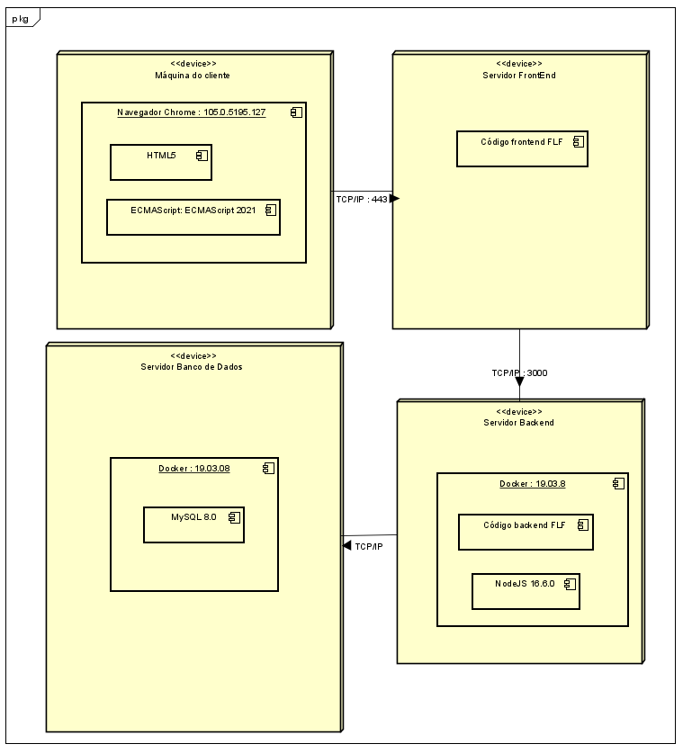

# Documentações

- [Documentações](#documentações)
  - [Diagrama de Classes](#diagrama-de-classes)
  - [Diagrama de sequência](#diagrama-de-sequência)
  - [Diagrama de Implantação](#diagrama-de-implantação)
  - [APIs](#apis)

## Diagrama de Classes

O diagrama de classes é uma representação da estrutura e relações das classes que servem de modelo para objetos.

## Diagrama de sequência

Diagrama de sequência (ou Diagrama de Sequência de Mensagens) é um diagrama usado em UML (Unified Modeling Language), representando a sequência de processos (mais especificamente, de mensagens passadas entre objetos) em um software.

## Diagrama de Implantação

O diagrama de implementação descreve a implementação física de informações geradas pelo programa de software em componentes de hardware.  
A informação gerada pelo software é chamada de artefato.  
As caixas tridimensionais conhecidas como nódulos, representam os elementos básicos de software ou hardware, ou nódulos no sistema.  
As linhas de nódulo a nódulo indicam relacionamentos e as formas menores contidas dentro das caixas representam os artefatos de software empregados.

## APIs

As documentações de APIs seguiram o padrão [OpenApi Specification](https://swagger.io/specification/).  
A OpenAPI Specification (OAS) define uma interface padrão independente de linguagem para APIs RESTful que permite que humanos e computadores descubram e compreendam os recursos do serviço sem acesso ao código-fonte, documentação ou por meio de inspeção de tráfego de rede. Quando definido corretamente, um consumidor pode entender e interagir com o serviço remoto com uma quantidade mínima de lógica de implementação.  
Uma definição OpenAPI pode ser usada por ferramentas de geração de documentação para exibir a API, ferramentas de geração de código para gerar servidores e clientes em várias linguagens de programação, ferramentas de teste e muitos outros casos de uso.  

Os arquivos que documentam estas APIs estarão no formato .yaml e serão salvos dentro do diretório [`Documentação/APIs/`](APIs/) com o nome no formato `{{nome_do_componente}}.yaml`.